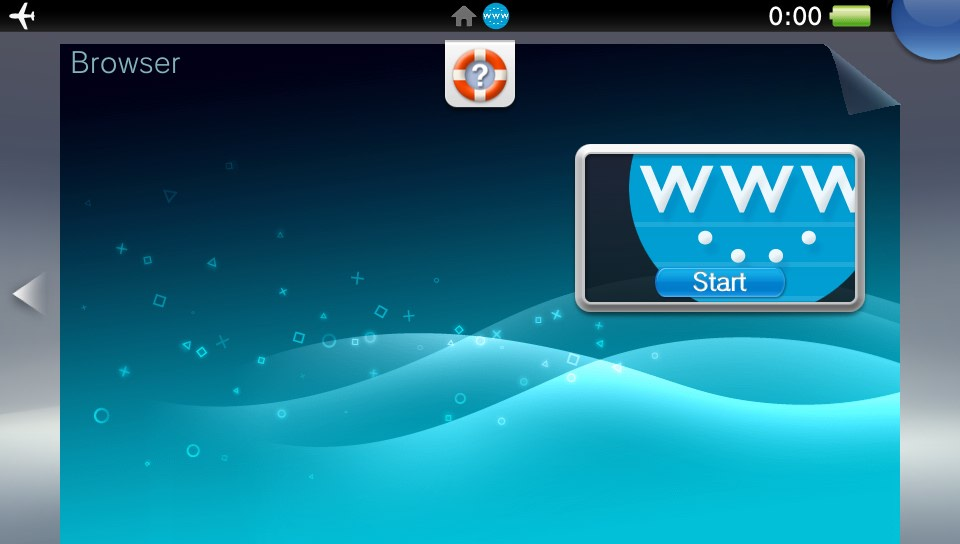
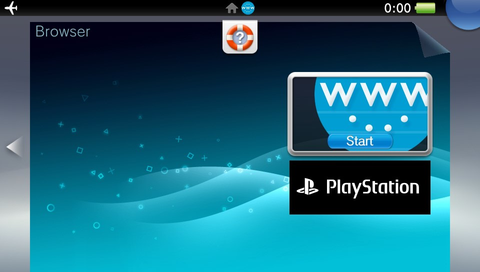
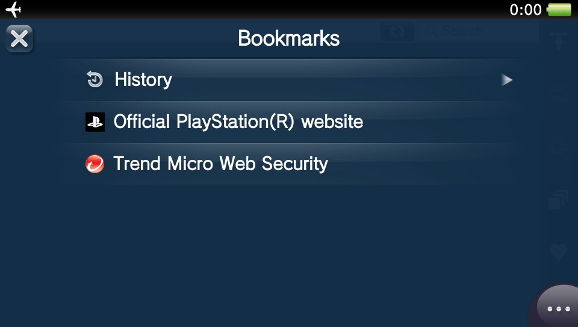

# psv_esphaku
PS Vita/TV 3.55-3.60 and 3.63-3.74 HENkaku for [NodeMcu](https://www.nodemcu.com/index_en.html#fr_54747661d775ef1a3600009e) board

ESPhaku IP address is 11.22.33.44

## Building (Windows)
  * Download and install or unpack [Arduino IDE](https://docs.arduino.cc/software/ide-v1/tutorials/PortableIDE/) (v1.8.19 is recommended)
  * [Configure IDE](https://arduino-esp8266.readthedocs.io/en/latest/installing.html) to use ESP8266 based board (v3.1.2 is the tested one)
  * Clone project repo as "esphaku" and open "esphaku.ino" in the IDE
    * Select the "NodeMCU v1.0 (ESP-12E Module)" as target board
    * Select the "4MB (FS:3MB OTA:~512KB)" as flash size
    * Export firmware as binary file by pressing "Ctrl+Alt+S"
  * Run the "0getffs.bat" file and wait for it to complete
    * Requirement: [wget.exe](https://eternallybored.org/misc/wget/)
  * Connect the ESP8266 based board to your PC now
  * Run the "1spiffs.bat" file and wait for it to complete
    * Requirement: [mkspiffs.exe](https://github.com/igrr/mkspiffs)
    * Requirement: [python3.exe](https://www.python.org/)
  * Run the "2flash.bat" file and wait for it to complete
    * Requirement: [esptool.exe](https://github.com/espressif/esptool/releases/tag/v4.10.0)

## Usage (PS Vita/TV)
  * Connect your PS Vita/TV to the "ESPhaku" [access point](https://manuals.playstation.net/document/en/psvita/settings/internet.html)
  * Select the [Browser](https://manuals.playstation.net/document/en/psvita/browser/livearea.html) application from the [home screen](https://manuals.playstation.net/document/en/psvita/basic/screens.html)
    * Press Help button (the "B" one) **OR**

Screenshot

    * Press PS banner (the "D" one) **OR**

Screenshot

    * Start Browser (the "C" one) and select official PS website bookmark **OR**

Screenshot

    * Start Browser (the "C" one) and enter something like "/" to the [address bar](https://manuals.playstation.net/document/en/psvita/browser/browse.html) (the "C" one, again)
  * Read the text on the screen

## Tested boards
  * NodeMCU v3 "Lolin" by Wemos (at [AliExpress](https://aliexpress.com/item/1005001566320429.html))
